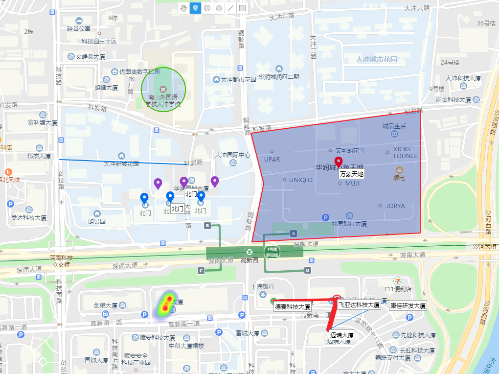
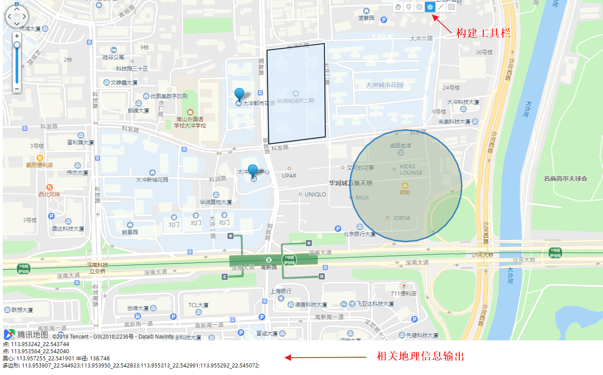

# LeoQmap

* 基于腾讯地图的LBS可视化展示与构建工具.
* 支持展示热力图、LBS复杂网络、多边形、圆、线、点和标记
* 支持多种点的类型
* 支持可视化构建点、圆、多边形，并输出相关地理经纬度信息

# 地图可视化展示

## 示例代码
```javascript
  drawHeat(geoheat); //画热力图
  drawNetwork(nodes, edges); //画LBS复杂网络
  drawPolygon('113.953983_22.542654;113.954262_22.541634;113.954004_22.540454;113.957695_22.540633;113.957695_22.543110;', '_', ';', colors.red); //画多边形
  drawCirle(113.952062, 22.543536, 50, colors.green); //画圆
  drawLine(113.949788, 22.542119, 113.952577, 22.542020, 2, colors.blue); //画线
  drawMarker(113.955903, 22.541941, '万象天地', markerType.red); //画单个点和标记
  drawMarkers("113.951644_22.541207;113.952212_22.541237_北门;113.952888_22.541247", "_", ";", markerType.blue); //画多个点和标记
  drawMarkers("113.951644_22.541207;113.952212_22.541237_北门;113.952888_22.541247", "_", ";", markerType.purple, 0.0003); //画多个点和标记+坐标调整
```

## 输出结果



# 地图可视化构建

支持可视化构建点、圆、多边形，并输出相关地理经纬度信息



